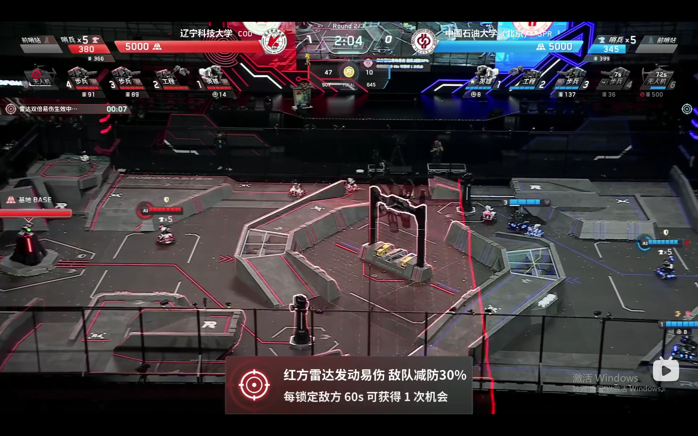
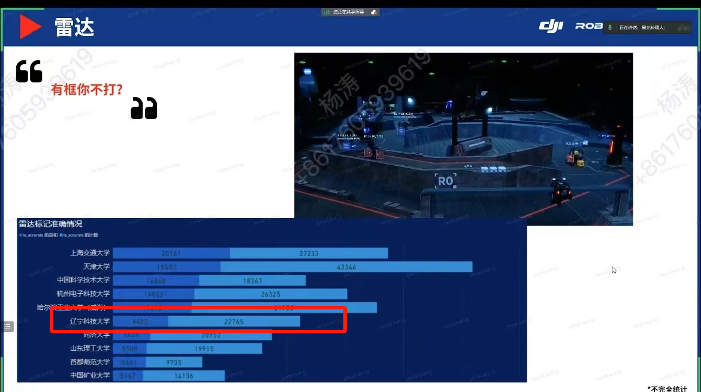

# COD-2024 Simple Radar Station Open Source

#### Special Note
The intention behind this open-source project is to serve as a starting point. **It aims to perform BFS in scenarios where traditional radar stations fail to detect targets, or in areas where the field of view is obstructed by the arena layout.**   

#### Software Features

1.  This project is an open-source, pure-computing radar station based on the RM2024 rule framework, operating without LiDAR or cameras. 
2.  Core Idea: Leveraging the rule that the referee system provides feedback after accurate marking, it performs a breadth-first search on high-frequency areas where robots are likely to appear. 
3.  If a target robot exists within a 1.6m radius of the marked point, the referee system will register it as a partial hit. Therefore, only two points are needed to cover the Sentinel patrol zone. Similarly, this approach can cover the Hero's "Happy Point" behind the high ring, the Sniper Point heroes on the R3 hill, and the Infantry near the lower high ring and symbol points.

#### Software Demo
[For the running effect, please watch the competition video](https://www.bilibili.com/video/BV1us421P73o/?spm_id_from=333.788&vd_source=1d37ae9e25605e1121cee9187de16dab)

#### Dependencies & Hardware/Software Environment

1.  The project runs on python3.8
2.  Requires the installation of pyserial dependency
3.  Connect a USB-to-TTL module to the computing station, and modify the corresponding COM port in the source code

#### File Description

1.  referee_info_update is used to receive and update referee system data, where referee.radar_mark_data represents the marking progress, referee.dart_info indicates the dart target aimed by the gimbal operator, and referee.count is the number of triggerable double damage vulnerability instances.
2.  send_data is used to transmit radar data. Please modify the target robot ID and coordinates according to your actual situation. Note that the maximum transmission frequency is 10hz.
3.  send_double is used to trigger double damage vulnerability. Please modify the robot ID based on the Red or Blue team.
4.  When double damage vulnerability charges are available, the gimbal operator can trigger it during the match by using the "Switch Dart Target" function on the client, which corresponds to pressing the J key.

#### Optimization Directions
1.  Building upon traditional radar stations, this performs BFS search in scenarios where traditional radar fails to detect targets, or in areas where the field of view is obstructed by the arena.
2.  Uses BFS to search for targets, then switches to DFS to improve locking precision once feedback progress increases.
For detailed ideas and future prospects, please refer to the document uploaded by @Bao Tianlong. [RM_Radar Ideas and Prospects by: Bao Tianlong](https://gitee.com/ustl-cod/cod-2024-radar/blob/master/RM_Radar%20%E6%80%9D%E8%B7%AF.pdf) 
#### Contact

QQ: 1296828054 Yang Tao

#### Special Acknowledgments
Thanks to  **Bao Tianlong**  for providing the project concept 
Thanks to  **Wang Baicheng, Zhao Xin**  for helping to refine the project 
Thanks to every member of the  **COD Team**  for their support and assistance 
