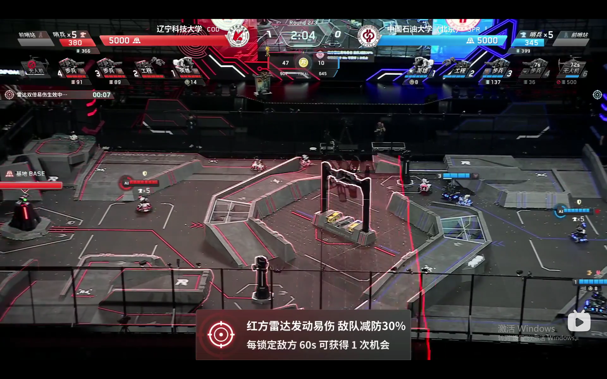
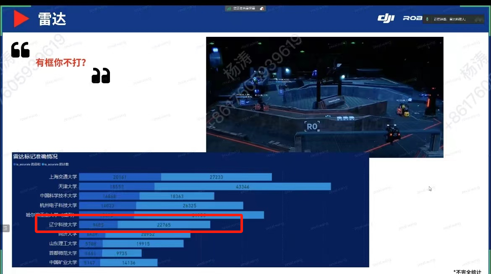

# COD-2024简易雷达站开源

#### 特别说明
希望这份开源更多是抛砖引玉， **在传统雷达站识别不到目标的情况，或者对于被场地遮挡视野的区域进行BFS。**   

#### 软件功能介绍

1.  本项目是基于RM2024规则框架下的无激光雷达，无相机的纯运算端雷达站开源。 
2.  思路：基于标点准确后裁判系统会有反馈这一规则，对机器人出现的高频区域进行广度搜索。 
3.  如果标点后在目标点半径范围1.6m存在目标机器人，裁判系统会判定为半准确，所以只用两个点就可以覆盖到哨兵巡逻区。同理可以覆盖到环高后的英雄快乐点和R3高地的狙击点中的英雄。同理可以覆盖到环高下和打符点的步兵。

#### 软件效果展示
[运行效果请看比赛视频](https://www.bilibili.com/video/BV1us421P73o/?spm_id_from=333.788&vd_source=1d37ae9e25605e1121cee9187de16dab)

#### 依赖工具&软硬件环境

1.  项目基于python3.8运行
2.  需要安装pyserial依赖
3.  使用USB转TTL模块插入运算端，在源码中修改对应COM口

#### 文件说明

1.  referee_info_update用于接受和更新裁判系统数据，其中referee.radar_mark_data为标记进度，referee.dart_info为云台手端飞镖瞄准目标，referee.count为可触发的双倍增伤次数。
2.  send_data用于发送雷达数据，请根据实际情况修改目标机器人ID和坐标，请注意发送频率上限为10hz。
3.  send_double用于触发双倍增伤，请根据红蓝方修改机器人ID。
4.  有双倍易伤次数的情况下，云台手在比赛中利用客户端上的“切换飞镖瞄准目标”功能，即按下J键即可触发双倍易伤。

#### 优化方向
1.  基于传统雷达站，在传统雷达站识别不到目标的情况，或者对于被场地遮挡视野的区域进行BFS搜索。
2.  使用BFS搜索目标，反馈进度增加后再使用DFS提高锁定精度。
详细思路和展望可以查看@鲍天龙 上传的文档。[RM_Radar思路和展望 by:鲍天龙](https://gitee.com/ustl-cod/cod-2024-radar/blob/master/RM_Radar%20%E6%80%9D%E8%B7%AF.pdf) 
#### Contact

qq:1296828054 杨涛

#### 特别致谢
感谢  **鲍天龙**  同学提供项目思路 
感谢  **王柏程、赵欣** 同学帮助完善项目 
感谢  **COD战队** 每个同学的支持和帮助 
